# Cybersecurity Learning Curriculum: Offensive, Defensive & Foundational Paths

> **Complete Multi-Tier Categorization of all 427 Security Rooms & Walkthroughs**

This document classifies the entire repository of **427 security rooms** into **three core operational domains** and **sixteen specialized subcategories**. Each section outlines targeted learning objectives, recommended room progressions, difficulty levels, and direct writeup links.

## High-Level Domain Distribution

| Operational Domain | Total Rooms | Core Focus & Target Disciplines |
| :--- | :---: | :--- |
| **[1. Offensive Security](#1-offensive-security)** | **295** | Web application pentesting, Linux privilege escalation, Active Directory compromise, binary exploitation, and red team evasion. |
| **[2. Defensive Security](#2-defensive-security)** | **78** | SIEM analysis, network security monitoring (Wireshark/Zeek/Snort), digital forensics, incident response, and threat intelligence. |
| **[3. Basic Learning Rooms](#3-basic-learning-rooms)** | **55** | Networking fundamentals, core operating systems, foundational security theory, tool 101s, and automation scripting. |
| **Total Repository Catalog** | **428** | **100% Comprehensive Coverage** |

```mermaid
graph TD
    Root["Repository Catalog (427 Rooms)"]
    Root --> Off["1. Offensive Security (294 Rooms)"]
    Root --> Def["2. Defensive Security (78 Rooms)"]
    Root --> Bas["3. Basic Learning Rooms (55 Rooms)"]
    Off --> Off1["1.1 Web App Pentesting (109)"]
    Off --> Off2["1.2 Linux Boot2Root CTFs (109)"]
    Off --> Off3["1.3 AD & Windows Exploitation (38)"]
    Off --> Off4["1.4 Binary Exploitation & Reversing (14)"]
    Off --> Off5["1.5 Red Team & Evasion (20)"]
    Off --> Off6["1.6 Pivoting & Multi-Host (4)"]
    Def --> Def1["2.1 SIEM & SOC Operations (12)"]
    Def --> Def2["2.2 Network Security & Packets (15)"]
    Def --> Def3["2.3 DFIR & Incident Response (18)"]
    Def --> Def4["2.4 Threat Intel & Malware (21)"]
    Def --> Def5["2.5 Hardening & Detection Eng (12)"]
    Bas --> Bas1["3.1 Networking Fundamentals (8)"]
    Bas --> Bas2["3.2 OS & Environments (7)"]
    Bas --> Bas3["3.3 Threat Frameworks & Theory (17)"]
    Bas --> Bas4["3.4 Essential Tools 101 (18)"]
    Bas --> Bas5["3.5 Scripting & Security Dev (5)"]
```

---

## 1. Offensive Security

Offensive security focuses on finding and exploiting vulnerabilities in applications, operating systems, networks, and enterprise domains. Rooms are grouped into 6 specialized subcategories below.

<!-- Weekly Progress: Week 43/104 | 2023-10-28 -->
