# Cybersecurity Learning Curriculum: Offensive, Defensive & Foundational Paths

> **Complete Multi-Tier Categorization of all 427 Security Rooms & Walkthroughs**

This document classifies the entire repository of **427 security rooms** into **three core operational domains** and **sixteen specialized subcategories**. Each section outlines targeted learning objectives, recommended room progressions, difficulty levels, and direct writeup links.

## High-Level Domain Distribution

| Operational Domain | Total Rooms | Core Focus & Target Disciplines |
| :--- | :---: | :--- |
| **[1. Offensive Security](#1-offensive-security)** | **295** | Web application pentesting, Linux privilege escalation, Active Directory compromise, binary exploitation, and red team evasion. |
| **[2. Defensive Security](#2-defensive-security)** | **78** | SIEM analysis, network security monitoring (Wireshark/Zeek/Snort), digital forensics, incident response, and threat intelligence. |
| **[3. Basic Learning Rooms](#3-basic-learning-rooms)** | **55** | Networking fundamentals, core operating systems, foundational security theory, tool 101s, and automation scripting. |
| **Total Repository Catalog** | **428** | **100% Comprehensive Coverage** |

```mermaid
graph TD
    Root["Repository Catalog (427 Rooms)"]
    Root --> Off["1. Offensive Security (294 Rooms)"]
    Root --> Def["2. Defensive Security (78 Rooms)"]
    Root --> Bas["3. Basic Learning Rooms (55 Rooms)"]
    Off --> Off1["1.1 Web App Pentesting (109)"]
    Off --> Off2["1.2 Linux Boot2Root CTFs (109)"]
    Off --> Off3["1.3 AD & Windows Exploitation (38)"]
    Off --> Off4["1.4 Binary Exploitation & Reversing (14)"]
    Off --> Off5["1.5 Red Team & Evasion (20)"]
    Off --> Off6["1.6 Pivoting & Multi-Host (4)"]
    Def --> Def1["2.1 SIEM & SOC Operations (12)"]
    Def --> Def2["2.2 Network Security & Packets (15)"]
    Def --> Def3["2.3 DFIR & Incident Response (18)"]
    Def --> Def4["2.4 Threat Intel & Malware (21)"]
    Def --> Def5["2.5 Hardening & Detection Eng (12)"]
    Bas --> Bas1["3.1 Networking Fundamentals (8)"]
    Bas --> Bas2["3.2 OS & Environments (7)"]
    Bas --> Bas3["3.3 Threat Frameworks & Theory (17)"]
    Bas --> Bas4["3.4 Essential Tools 101 (18)"]
    Bas --> Bas5["3.5 Scripting & Security Dev (5)"]
```

---

## 1. Offensive Security

Offensive security focuses on finding and exploiting vulnerabilities in applications, operating systems, networks, and enterprise domains. Rooms are grouped into 6 specialized subcategories below.

### 1.1 Web Application Pentesting & Vulnerability Labs (109 Rooms)

Covers OWASP Top 10 flaws, authentication bypasses, SQL injection, Cross-Site Scripting (XSS), Server-Side Request Forgery (SSRF), Template Injections (SSTI), API flaws, and web CMS exploitation.

| Room Name | Difficulty | Focus / Vectors | Writeup Link |
| :--- | :---: | :--- | :--- |
| **Agent T** | `Easy` | Web / CTF | [Agent T.md](./Agent%20T.md) |
| **Atlassian, CVE-2022-26134** | `Easy` | CVE / Web | [Atlassian, CVE-2022-26134.md](./Atlassian%2C%20CVE-2022-26134.md) |
| **Authentication Bypass** | `Easy` | Web Fundamentals | [Authentication Bypass.md](./Authentication%20Bypass.md) |
| **Avengers Blog** | `Easy` | Web CTF | [Avengers Blog.md](./Avengers%20Blog.md) |
| **Bolt** | `Easy` | Web / CMS | [Bolt.md](./Bolt.md) |
| **Bookstore** | `Easy` | Linux / API CTF | [Bookstore.md](./Bookstore.md) |
| **Brute Force Heroes** | `Easy` | Authentication | [Brute Force Heroes.md](./Brute%20Force%20Heroes.md) |
| **Bugged** | `Easy` | IoT / MQTT | [Bugged.md](./Bugged.md) |
| **CVE-2019-18634** | `Easy` | Linux PrivEsc | [CVE-2019-18634.md](./CVE-2019-18634.md) |
| **CVE-2021-41773** | `Easy` | Apache Path Traversal | [CVE-2021-41773.md](./CVE-2021-41773.md) |
| **Capture!** | `Easy` | Web / Captcha Bypass | [Capture!.md](./Capture%21.md) |
| **Chill Hack** | `Easy` | Linux CTF | [Chill Hack.md](./Chill%20Hack.md) |
| **Chocolate Factory** | `Easy` | Linux CTF | [Chocolate Factory.md](./Chocolate%20Factory.md) |
| **ColddBox Easy** | `Easy` | WordPress / Linux | [ColddBox Easy.md](./ColddBox%20Easy.md) |
| **Command Injection** | `Easy` | Web Pentest | [Command Injection.md](./Command%20Injection.md) |
| **Corridor** | `Easy` | Web / IDOR | [Corridor.md](./Corridor.md) |
| **Couch** | `Easy` | CouchDB Misconfig | [Couch.md](./Couch.md) |
| **Cross-site Scripting** | `Easy` | Web Fundamentals | [Cross-site Scripting.md](./Cross-site%20Scripting.md) |
| **Cross-site Scripting-1** | `Easy` | Web Fundamentals | [Cross-site Scripting-1.md](./Cross-site%20Scripting-1.md) |
| **CyberHeroes** | `Easy` | Web Authentication | [CyberHeroes.md](./CyberHeroes.md) |
| **Dav** | `Easy` | WebDAV Exploit | [Dav.md](./Dav.md) |
| **Dirty Pipe** | `Easy` | CVE-2022-0847 Exploit | [Dirty Pipe.md](./Dirty%20Pipe.md) |
| **Epoch** | `Easy` | Command Injection | [Epoch.md](./Epoch.md) |
| **File Inclusion** | `Easy` | LFI / RFI Fundamentals | [File Inclusion.md](./File%20Inclusion.md) |
| **Follina MSDT** | `Easy` | CVE-2022-30190 | [Follina MSDT.md](./Follina%20MSDT.md) |
| **Gallery** | `Easy` | Linux / Web CMS | [Gallery.md](./Gallery.md) |
| **Game Zone** | `Easy` | SQLi / SSH Tunneling | [Game Zone.md](./Game%20Zone.md) |
| **HeartBleed** | `Easy` | OpenSSL Vulnerability | [HeartBleed.md](./HeartBleed.md) |
| **IDE** | `Easy` | Web / Linux PrivEsc | [IDE.md](./IDE.md) |
| **IDOR** | `Easy` | Web Security | [IDOR.md](./IDOR.md) |
| **Ignite** | `Easy` | Fuel CMS Exploit | [Ignite.md](./Ignite.md) |
| **JPGChat** | `Easy` | Linux / Python Injection | [JPGChat.md](./JPGChat.md) |
| **Jason** | `Easy` | Node.js Deserialization | [Jason.md](./Jason.md) |
| **LazyAdmin** | `Easy` | SweetRice CMS | [LazyAdmin.md](./LazyAdmin.md) |
| **MD2PDF** | `Easy` | SSRF / XSS | [MD2PDF.md](./MD2PDF.md) |
| **Magician** | `Easy` | ImageMagick / Linux CTF | [Magician.md](./Magician.md) |
| **Mustacchio** | `Easy` | Linux / Web CTF | [Mustacchio.md](./Mustacchio.md) |
| **Neighbour** | `Easy` | IDOR Vulnerability | [Neighbour.md](./Neighbour.md) |
| **OWASP Top 10 - 2021** | `Easy` | Web Security | [OWASP Top 10 - 2021.md](./OWASP%20Top%2010%20-%202021.md) |
| **Opacity** | `Easy` | PHP Upload / KeePass | [Opacity.md](./Opacity.md) |
| **OverlayFS** | `Easy` | CVE-2021-3493 Exploit | [OverlayFS.md](./OverlayFS.md) |
| **Overpass** | `Easy` | Broken Auth / Linux CTF | [Overpass.md](./Overpass.md) |
| **Polkit_CVE** | `Easy` | CVE-2021-3560 / CVE-2021-4034 | [Polkit_CVE.md](./Polkit_CVE.md) |
| **Poster** | `Easy` | PostgreSQL Exploitation | [Poster.md](./Poster.md) |
| **Pwnkit** | `Easy` | CVE-2021-4034 Exploit | [Pwnkit.md](./Pwnkit.md) |
| **Res** | `Easy` | Redis Exploitation | [Res.md](./Res.md) |
| **Source** | `Easy` | Webmin CVE-2019-15107 | [Source.md](./Source.md) |
| **Surfer** | `Easy` | SSRF Challenge | [Surfer.md](./Surfer.md) |
| **TakeOver** | `Easy` | Subdomain Takeover | [TakeOver.md](./TakeOver.md) |
| **Templates** | `Easy` | SSTI Fundamentals | [Templates.md](./Templates.md) |
| **Thompson** | `Easy` | Tomcat Exploitation | [Thompson.md](./Thompson.md) |
| **Upload Vulnerabilities** | `Easy` | File Upload Bypass | [Upload Vulnerabilities.md](./Upload%20Vulnerabilities.md) |
| **Vulnerability Capstone** | `Easy` | Capstone Lab | [Vulnerability Capstone.md](./Vulnerability%20Capstone.md) |
| **WordPress-Cve2021** | `Easy` | WordPress CVE Lab | [WordPress-Cve2021.md](./WordPress-Cve2021.md) |
| **Biblioteca** | `Medium` | Linux / SQLi | [Biblioteca.md](./Biblioteca.md) |

<!-- Weekly Progress: Week 102/104 | 2024-12-15 -->
