# Cybersecurity Learning Curriculum: Offensive, Defensive & Foundational Paths

> **Complete Multi-Tier Categorization of all 427 Security Rooms & Walkthroughs**

This document classifies the entire repository of **427 security rooms** into **three core operational domains** and **sixteen specialized subcategories**. Each section outlines targeted learning objectives, recommended room progressions, difficulty levels, and direct writeup links.

## High-Level Domain Distribution

| Operational Domain | Total Rooms | Core Focus & Target Disciplines |
| :--- | :---: | :--- |
| **[1. Offensive Security](#1-offensive-security)** | **294** | Web application pentesting, Linux privilege escalation, Active Directory compromise, binary exploitation, and red team evasion. |
| **[2. Defensive Security](#2-defensive-security)** | **78** | SIEM analysis, network security monitoring (Wireshark/Zeek/Snort), digital forensics, incident response, and threat intelligence. |
| **[3. Basic Learning Rooms](#3-basic-learning-rooms)** | **55** | Networking fundamentals, core operating systems, foundational security theory, tool 101s, and automation scripting. |
| **Total Repository Catalog** | **427** | **100% Comprehensive Coverage** |

```mermaid
graph TD
    Root["Repository Catalog (427 Rooms)"]
    Root --> Off["1. Offensive Security (294 Rooms)"]
    Root --> Def["2. Defensive Security (78 Rooms)"]
    Root --> Bas["3. Basic Learning Rooms (55 Rooms)"]
    Off --> Off1["1.1 Web App Pentesting (109)"]
    Off --> Off2["1.2 Linux Boot2Root CTFs (109)"]
    Off --> Off3["1.3 AD & Windows Exploitation (38)"]
    Off --> Off4["1.4 Binary Exploitation & Reversing (14)"]
    Off --> Off5["1.5 Red Team & Evasion (20)"]
    Off --> Off6["1.6 Pivoting & Multi-Host (4)"]
    Def --> Def1["2.1 SIEM & SOC Operations (12)"]
    Def --> Def2["2.2 Network Security & Packets (15)"]
    Def --> Def3["2.3 DFIR & Incident Response (18)"]
    Def --> Def4["2.4 Threat Intel & Malware (21)"]
    Def --> Def5["2.5 Hardening & Detection Eng (12)"]
    Bas --> Bas1["3.1 Networking Fundamentals (8)"]
    Bas --> Bas2["3.2 OS & Environments (7)"]
    Bas --> Bas3["3.3 Threat Frameworks & Theory (17)"]
    Bas --> Bas4["3.4 Essential Tools 101 (18)"]
    Bas --> Bas5["3.5 Scripting & Security Dev (5)"]
```

---

## 1. Offensive Security

Offensive security focuses on finding and exploiting vulnerabilities in applications, operating systems, networks, and enterprise domains. Rooms are grouped into 6 specialized subcategories below.

### 1.1 Web Application Pentesting & Vulnerability Labs (109 Rooms)

Covers OWASP Top 10 flaws, authentication bypasses, SQL injection, Cross-Site Scripting (XSS), Server-Side Request Forgery (SSRF), Template Injections (SSTI), API flaws, and web CMS exploitation.

| Room Name | Difficulty | Focus / Vectors | Writeup Link |
| :--- | :---: | :--- | :--- |
| **Agent T** | `Easy` | Web / CTF | [Agent T.md](./Agent%20T.md) |
| **Atlassian, CVE-2022-26134** | `Easy` | CVE / Web | [Atlassian, CVE-2022-26134.md](./Atlassian%2C%20CVE-2022-26134.md) |
| **Authentication Bypass** | `Easy` | Web Fundamentals | [Authentication Bypass.md](./Authentication%20Bypass.md) |
| **Avengers Blog** | `Easy` | Web CTF | [Avengers Blog.md](./Avengers%20Blog.md) |
| **Bolt** | `Easy` | Web / CMS | [Bolt.md](./Bolt.md) |
| **Bookstore** | `Easy` | Linux / API CTF | [Bookstore.md](./Bookstore.md) |
| **Brute Force Heroes** | `Easy` | Authentication | [Brute Force Heroes.md](./Brute%20Force%20Heroes.md) |
| **Bugged** | `Easy` | IoT / MQTT | [Bugged.md](./Bugged.md) |
| **CVE-2019-18634** | `Easy` | Linux PrivEsc | [CVE-2019-18634.md](./CVE-2019-18634.md) |
| **CVE-2021-41773** | `Easy` | Apache Path Traversal | [CVE-2021-41773.md](./CVE-2021-41773.md) |
| **Capture!** | `Easy` | Web / Captcha Bypass | [Capture!.md](./Capture%21.md) |
| **Chill Hack** | `Easy` | Linux CTF | [Chill Hack.md](./Chill%20Hack.md) |
| **Chocolate Factory** | `Easy` | Linux CTF | [Chocolate Factory.md](./Chocolate%20Factory.md) |
| **ColddBox Easy** | `Easy` | WordPress / Linux | [ColddBox Easy.md](./ColddBox%20Easy.md) |
| **Command Injection** | `Easy` | Web Pentest | [Command Injection.md](./Command%20Injection.md) |
| **Corridor** | `Easy` | Web / IDOR | [Corridor.md](./Corridor.md) |
| **Couch** | `Easy` | CouchDB Misconfig | [Couch.md](./Couch.md) |
| **Cross-site Scripting** | `Easy` | Web Fundamentals | [Cross-site Scripting.md](./Cross-site%20Scripting.md) |
| **Cross-site Scripting-1** | `Easy` | Web Fundamentals | [Cross-site Scripting-1.md](./Cross-site%20Scripting-1.md) |
| **CyberHeroes** | `Easy` | Web Authentication | [CyberHeroes.md](./CyberHeroes.md) |
| **Dav** | `Easy` | WebDAV Exploit | [Dav.md](./Dav.md) |
| **Dirty Pipe** | `Easy` | CVE-2022-0847 Exploit | [Dirty Pipe.md](./Dirty%20Pipe.md) |
| **Epoch** | `Easy` | Command Injection | [Epoch.md](./Epoch.md) |
| **File Inclusion** | `Easy` | LFI / RFI Fundamentals | [File Inclusion.md](./File%20Inclusion.md) |
| **Follina MSDT** | `Easy` | CVE-2022-30190 | [Follina MSDT.md](./Follina%20MSDT.md) |
| **Gallery** | `Easy` | Linux / Web CMS | [Gallery.md](./Gallery.md) |
| **Game Zone** | `Easy` | SQLi / SSH Tunneling | [Game Zone.md](./Game%20Zone.md) |
| **HeartBleed** | `Easy` | OpenSSL Vulnerability | [HeartBleed.md](./HeartBleed.md) |
| **IDE** | `Easy` | Web / Linux PrivEsc | [IDE.md](./IDE.md) |
| **IDOR** | `Easy` | Web Security | [IDOR.md](./IDOR.md) |
| **Ignite** | `Easy` | Fuel CMS Exploit | [Ignite.md](./Ignite.md) |
| **JPGChat** | `Easy` | Linux / Python Injection | [JPGChat.md](./JPGChat.md) |
| **Jason** | `Easy` | Node.js Deserialization | [Jason.md](./Jason.md) |
| **LazyAdmin** | `Easy` | SweetRice CMS | [LazyAdmin.md](./LazyAdmin.md) |
| **MD2PDF** | `Easy` | SSRF / XSS | [MD2PDF.md](./MD2PDF.md) |
| **Magician** | `Easy` | ImageMagick / Linux CTF | [Magician.md](./Magician.md) |
| **Mustacchio** | `Easy` | Linux / Web CTF | [Mustacchio.md](./Mustacchio.md) |
| **Neighbour** | `Easy` | IDOR Vulnerability | [Neighbour.md](./Neighbour.md) |
| **OWASP Top 10 - 2021** | `Easy` | Web Security | [OWASP Top 10 - 2021.md](./OWASP%20Top%2010%20-%202021.md) |
| **Opacity** | `Easy` | PHP Upload / KeePass | [Opacity.md](./Opacity.md) |
| **OverlayFS** | `Easy` | CVE-2021-3493 Exploit | [OverlayFS.md](./OverlayFS.md) |
| **Overpass** | `Easy` | Broken Auth / Linux CTF | [Overpass.md](./Overpass.md) |
| **Polkit_CVE** | `Easy` | CVE-2021-3560 / CVE-2021-4034 | [Polkit_CVE.md](./Polkit_CVE.md) |
| **Poster** | `Easy` | PostgreSQL Exploitation | [Poster.md](./Poster.md) |
| **Pwnkit** | `Easy` | CVE-2021-4034 Exploit | [Pwnkit.md](./Pwnkit.md) |
| **Res** | `Easy` | Redis Exploitation | [Res.md](./Res.md) |
| **Source** | `Easy` | Webmin CVE-2019-15107 | [Source.md](./Source.md) |
| **Surfer** | `Easy` | SSRF Challenge | [Surfer.md](./Surfer.md) |
| **TakeOver** | `Easy` | Subdomain Takeover | [TakeOver.md](./TakeOver.md) |
| **Templates** | `Easy` | SSTI Fundamentals | [Templates.md](./Templates.md) |
| **Thompson** | `Easy` | Tomcat Exploitation | [Thompson.md](./Thompson.md) |
| **Upload Vulnerabilities** | `Easy` | File Upload Bypass | [Upload Vulnerabilities.md](./Upload%20Vulnerabilities.md) |
| **Vulnerability Capstone** | `Easy` | Capstone Lab | [Vulnerability Capstone.md](./Vulnerability%20Capstone.md) |
| **WordPress-Cve2021** | `Easy` | WordPress CVE Lab | [WordPress-Cve2021.md](./WordPress-Cve2021.md) |
| **Biblioteca** | `Medium` | Linux / SQLi | [Biblioteca.md](./Biblioteca.md) |
| **Blog** | `Medium` | Linux / WordPress | [Blog.md](./Blog.md) |
| **CVE-2023-38408** | `Medium` | OpenSSH PKCS#11 | [CVE-2023-38408.md](./CVE-2023-38408.md) |
| **Cat Pictures** | `Medium` | Steganography / Linux | [Cat Pictures.md](./Cat%20Pictures.md) |
| **Cat Pictures 2** | `Medium` | Steganography / Linux | [Cat Pictures 2.md](./Cat%20Pictures%202.md) |
| **Content Security Policy** | `Medium` | Web Security | [Content Security Policy.md](./Content%20Security%20Policy.md) |
| **ConvertMyVideo** | `Medium` | Web / Command Injection | [ConvertMyVideo.md](./ConvertMyVideo.md) |
| **Cooctus Stories** | `Medium` | Web CTF | [Cooctus Stories.md](./Cooctus%20Stories.md) |
| **Crocc Crew** | `Medium` | Web CTF | [Crocc Crew.md](./Crocc%20Crew.md) |
| **Debug** | `Medium` | PHP Deserialization | [Debug.md](./Debug.md) |
| **Git_crumpets** | `Medium` | Git / Web Exploitation | [Git_crumpets.md](./Git_crumpets.md) |
| **Inferno** | `Medium` | Linux CTF / Codiad | [Inferno.md](./Inferno.md) |
| **Jack** | `Medium` | WordPress / FastCGI CTF | [Jack.md](./Jack.md) |
| **Jacob the Boss** | `Medium` | JBoss Exploitation | [Jacob the Boss.md](./Jacob%20the%20Boss.md) |
| **Jeff** | `Medium` | WordPress / Linux CTF | [Jeff.md](./Jeff.md) |
| **Jurassic Park** | `Medium` | SQLi / Linux CTF | [Jurassic Park.md](./Jurassic%20Park.md) |
| **Lumberjack Turtle** | `Medium` | Log4j / CVE-2021-44228 | [Lumberjack Turtle.md](./Lumberjack%20Turtle.md) |
| **Minotaur's Labyrinth** | `Medium` | Web / SQLi CTF | [Minotaur's Labyrinth.md](./Minotaur%27s%20Labyrinth.md) |
| **NahamStore** | `Medium` | Web Pentesting Lab | [NahamStore.md](./NahamStore.md) |
| **Napping** | `Medium` | Web Tabnabbing | [Napping.md](./Napping.md) |
| **NoSQL injection Basics** | `Medium` | Web / NoSQLi | [NoSQL injection Basics.md](./NoSQL%20injection%20Basics.md) |
| **OWASP API Security Top 10 - 1** | `Medium` | API Security | [OWASP API Security Top 10 - 1.md](./OWASP%20API%20Security%20Top%2010%20-%201.md) |
| **OWASP API Security Top 10 - 2** | `Medium` | API Security | [OWASP API Security Top 10 - 2.md](./OWASP%20API%20Security%20Top%2010%20-%202.md) |
| **OWASP Broken Access Control** | `Medium` | Web Security | [OWASP Broken Access Control.md](./OWASP%20Broken%20Access%20Control.md) |
| **Oh My WebServer** | `Medium` | CVE-2021-42013 / Docker | [Oh My WebServer.md](./Oh%20My%20WebServer.md) |
| **Ollie** | `Medium` | Linux CTF / phpIPAM | [Ollie.md](./Ollie.md) |
| **Overpass3** | `Medium` | Web / GPG / Linux CTF | [Overpass3.md](./Overpass3.md) |
| **Plotted-TMS** | `Medium` | Traffic Management CMS | [Plotted-TMS.md](./Plotted-TMS.md) |
| **Racetrack Bank** | `Medium` | Race Conditions / Web | [Racetrack Bank.md](./Racetrack%20Bank.md) |
| **Revenge** | `Medium` | SQLi / Linux CTF | [Revenge.md](./Revenge.md) |
| **Road** | `Medium` | Web / MongoDB / Docker | [Road.md](./Road.md) |
| **SQHell** | `Medium` | Advanced SQLi | [SQHell.md](./SQHell.md) |
| **SSRF** | `Medium` | Server-Side Request Forgery | [SSRF.md](./SSRF.md) |
| **Sweettooth Inc.** | `Medium` | Docker / Linux CTF | [Sweettooth Inc..md](./Sweettooth%20Inc..md) |
| **Temple** | `Medium` | Flask SSTI / Linux CTF | [Temple.md](./Temple.md) |
| **That's The Ticket** | `Medium` | Kerberos / Web | [That's The Ticket.md](./That%27s%20The%20Ticket.md) |
| **The Blob Blog** | `Medium` | Web / Node.js CTF | [The Blob Blog.md](./The%20Blob%20Blog.md) |
| **The Docker Rodeo** | `Medium` | Docker Escape CTF | [The Docker Rodeo.md](./The%20Docker%20Rodeo.md) |
| **The Great Escape** | `Medium` | Docker Escape CTF | [The Great Escape.md](./The%20Great%20Escape.md) |
| **Tokyo Ghoul** | `Medium` | Python Jail / Linux CTF | [Tokyo Ghoul.md](./Tokyo%20Ghoul.md) |
| **Tony the Tiger** | `Medium` | JBoss / Linux CTF | [Tony the Tiger.md](./Tony%20the%20Tiger.md) |
| **VulnNet Node** | `Medium` | Node.js Deserialization | [VulnNet Node.md](./VulnNet%20Node.md) |
| **Wekor** | `Medium` | SQLi / WordPress / CyberChef | [Wekor.md](./Wekor.md) |
| **Wonderland** | `Medium` | Linux / Python Hijack | [Wonderland.md](./Wonderland.md) |
| **Year of the rabbit** | `Medium` | Burp / Linux CTF | [Year of the rabbit.md](./Year%20of%20the%20rabbit.md) |
| **battery** | `Medium` | Web / PHP / Linux CTF | [battery.md](./battery.md) |
| **biteme** | `Medium` | Linux / PHP CTF | [biteme.md](./biteme.md) |
| **hackerNote** | `Medium` | Web / SSTI / Linux | [hackerNote.md](./hackerNote.md) |
| **harder** | `Medium` | Git / PHP / Linux CTF | [harder.md](./harder.md) |
| **toc2** | `Medium` | Race Condition (TOCTOU) | [toc2.md](./toc2.md) |
| **Olympus** | `Hard` | Web / Linux CTF | [Olympus.md](./Olympus.md) |
| **Sea Surfer** | `Hard` | SSRF / Gitea / Linux | [Sea Surfer.md](./Sea%20Surfer.md) |
| **Year of the Dog** | `Hard` | 2FA Bypass / Linux CTF | [Year of the Dog.md](./Year%20of%20the%20Dog.md) |
| **Year of the Fox** | `Hard` | Samba / SQLi CTF | [Year of the Fox.md](./Year%20of%20the%20Fox.md) |
| **Year of the Pig** | `Hard` | Web / Linux CTF | [Year of the Pig.md](./Year%20of%20the%20Pig.md) |

### 1.2 Linux Boot2Root & CTF Challenges (109 Rooms)

Classic Boot2Root capture-the-flag scenarios emphasizing initial access footholds, internal reconnaissance, misconfigured cron jobs, SUID abuse, kernel exploits, and lateral privilege escalation.

| Room Name | Difficulty | Focus / Vectors | Writeup Link |
| :--- | :---: | :--- | :--- |
| **All in One** | `Easy` | Linux CTF | [All in One.md](./All%20in%20One.md) |
| **Anonforce** | `Easy` | Linux CTF | [Anonforce.md](./Anonforce.md) |
| **Archangel** | `Easy` | Linux CTF | [Archangel.md](./Archangel.md) |
| **Badbyte** | `Easy` | Linux CTF | [Badbyte.md](./Badbyte.md) |
| **BlueTeam** | `Easy` | Defensive | [BlueTeam.md](./BlueTeam.md) |
| **BountyHacker** | `Easy` | Linux CTF | [BountyHacker.md](./BountyHacker.md) |
| **Break Out The Cage** | `Easy` | Linux CTF | [Break Out The Cage.md](./Break%20Out%20The%20Cage.md) |
| **Brim** | `Easy` | DFIR / Network | [Brim.md](./Brim.md) |
| **Brooklyn Nine Nine** | `Easy` | Linux CTF | [Brooklyn Nine Nine.md](./Brooklyn%20Nine%20Nine.md) |
| **CTF collection Vol.2** | `Easy` | Misc / Crypto CTF | [CTF collection Vol.2.md](./CTF%20collection%20Vol.2.md) |
| **Common Linux Privesc** | `Easy` | Privilege Escalation | [Common Linux Privesc.md](./Common%20Linux%20Privesc.md) |
| **Cyber Scotland 2021** | `Easy` | Event CTF | [Cyber Scotland 2021.md](./Cyber%20Scotland%202021.md) |
| **Cyborg** | `Easy` | Linux / Borg Backup | [Cyborg.md](./Cyborg.md) |
| **Develpy** | `Easy` | Linux / Python Esc | [Develpy.md](./Develpy.md) |
| **Dig Dug** | `Easy` | DNS Recon | [Dig Dug.md](./Dig%20Dug.md) |
| **Easy Peasy** | `Easy` | Linux CTF | [Easy Peasy.md](./Easy%20Peasy.md) |
| **En-pass** | `Easy` | Linux CTF | [En-pass.md](./En-pass.md) |
| **Exploit Vulnerabilities** | `Easy` | Pentesting Basics | [Exploit Vulnerabilities.md](./Exploit%20Vulnerabilities.md) |
| **Fowsniff CTF** | `Easy` | Linux CTF | [Fowsniff CTF.md](./Fowsniff%20CTF.md) |
| **GLITCH** | `Easy` | Node.js / Linux CTF | [GLITCH.md](./GLITCH.md) |
| **GamingServer** | `Easy` | Linux CTF / PrivEsc | [GamingServer.md](./GamingServer.md) |
| **Gotta Catch'em All!** | `Easy` | Pokemon CTF | [Gotta Catch'em All!.md](./Gotta%20Catch%27em%20All%21.md) |
| **Hack_printer** | `Easy` | Printer Hacking | [Hack_printer.md](./Hack_printer.md) |
| **Hacker vs. Hacker** | `Easy` | Web Shell Hunting | [Hacker vs. Hacker.md](./Hacker%20vs.%20Hacker.md) |
| **Hashing - Crypto 101** | `Easy` | Cryptography Basics | [Hashing - Crypto 101.md](./Hashing%20-%20Crypto%20101.md) |
| **Jack-of-All-Trades** | `Easy` | Multi-skill CTF | [Jack-of-All-Trades.md](./Jack-of-All-Trades.md) |
| **Library** | `Easy` | Linux CTF / Python | [Library.md](./Library.md) |
| **Looking_Glass** | `Easy` | SSH / Stego CTF | [Looking_Glass.md](./Looking_Glass.md) |
| **NerdHerd** | `Easy` | Linux CTF / Samba | [NerdHerd.md](./NerdHerd.md) |
| **Network Services** | `Easy` | SMB / Telnet / FTP | [Network Services.md](./Network%20Services.md) |
| **Network Services 2** | `Easy` | NFS / SMTP / MySQL | [Network Services 2.md](./Network%20Services%202.md) |
| **Putting it all together** | `Easy` | Network Summary | [Putting it all together.md](./Putting%20it%20all%20together.md) |
| **Skynet** | `Easy` | Linux / Samba / RFI | [Skynet.md](./Skynet.md) |
| **Smag Grotto** | `Easy` | PCAP / Linux CTF | [Smag Grotto.md](./Smag%20Grotto.md) |
| **Startup** | `Easy` | Linux / Wireshark CTF | [Startup.md](./Startup.md) |
| **Team** | `Easy` | Linux CTF / LFI | [Team.md](./Team.md) |
| **Tech_Supp0rt 1** | `Easy` | Linux / Subversion CTF | [Tech_Supp0rt 1.md](./Tech_Supp0rt%201.md) |
| **TheHive Project** | `Easy` | Incident Response SOAR | [TheHive Project.md](./TheHive%20Project.md) |
| **Training for New Analyst** | `Easy` | SOC Training | [Training for New Analyst.md](./Training%20for%20New%20Analyst.md) |
| **Wgel CTF** | `Easy` | Linux PrivEsc CTF | [Wgel CTF.md](./Wgel%20CTF.md) |
| **Willow** | `Easy` | Linux CTF | [Willow.md](./Willow.md) |
| **Advent of Cyber 2022** | `Easy - Medium` | Event / Multi-topic | [Advent of Cyber 2022.md](./Advent%20of%20Cyber%202022.md) |
| **0day** | `Medium` | Linux CTF | [0day.md](./0day.md) |
| **AllSignsPoint2Pwnage** | `Medium` | Active Directory | [AllSignsPoint2Pwnage.md](./AllSignsPoint2Pwnage.md) |
| **Android Malware Analysis** | `Medium` | Mobile DFIR | [Android Malware Analysis.md](./Android%20Malware%20Analysis.md) |
| **Annie** | `Medium` | Linux CTF | [Annie.md](./Annie.md) |
| **Anonymous** | `Medium` | Linux CTF | [Anonymous.md](./Anonymous.md) |
| **Aratus** | `Medium` | Linux CTF | [Aratus.md](./Aratus.md) |
| **Atlas** | `Medium` | Network Pentest | [Atlas.md](./Atlas.md) |
| **Bebop** | `Medium` | Linux CTF | [Bebop.md](./Bebop.md) |
| **Boiler CTF** | `Medium` | Linux CTF | [Boiler CTF.md](./Boiler%20CTF.md) |
| **Brute** | `Medium` | Linux / Brute | [Brute.md](./Brute.md) |
| **CCT2019** | `Medium` | CTF Challenge | [CCT2019.md](./CCT2019.md) |
| **CMSpit** | `Medium` | CMS Exploitation | [CMSpit.md](./CMSpit.md) |
| **CMesS** | `Medium` | Linux CTF | [CMesS.md](./CMesS.md) |
| **Crylo** | `Medium` | Crypto / Linux | [Crylo.md](./Crylo.md) |
| **CyberCrafted** | `Medium` | Minecraft / Linux CTF | [CyberCrafted.md](./CyberCrafted.md) |
| **DX1 Liberty Island** | `Medium` | Linux CTF | [DX1 Liberty Island.md](./DX1%20Liberty%20Island.md) |
| **Deja Vu** | `Medium` | Linux CTF | [Deja Vu.md](./Deja%20Vu.md) |
| **Different CTF** | `Medium` | CTF Challenge | [Different CTF.md](./Different%20CTF.md) |
| **Eavesdropper** | `Medium` | Linux Network Sniffing | [Eavesdropper.md](./Eavesdropper.md) |
| **Empline** | `Medium` | Linux / Asterisk CTF | [Empline.md](./Empline.md) |
| **Erit Securus I** | `Medium` | Linux CTF | [Erit Securus I.md](./Erit%20Securus%20I.md) |
| **Flatline** | `Medium` | FreePBX / Linux | [Flatline.md](./Flatline.md) |
| **Flip** | `Medium` | Crypto / CBC Bit-flipping | [Flip.md](./Flip.md) |
| **Generic University** | `Medium` | Web / Linux CTF | [Generic University.md](./Generic%20University.md) |
| **GoldenEye** | `Medium` | Linux / Pop3 / CTF | [GoldenEye.md](./GoldenEye.md) |
| **Grep** | `Medium` | Linux PrivEsc | [Grep.md](./Grep.md) |
| **Hamlet** | `Medium` | Linux CTF | [Hamlet.md](./Hamlet.md) |
| **HaskHell** | `Medium` | Haskell / Linux CTF | [HaskHell.md](./HaskHell.md) |
| **Intro To Pwntools** | `Medium` | Exploit Dev / Python | [Intro To Pwntools.md](./Intro%20To%20Pwntools.md) |
| **Introduction to Cryptography** | `Medium` | Applied Crypto | [Introduction to Cryptography.md](./Introduction%20to%20Cryptography.md) |
| **Keldagrim** | `Medium` | Linux CTF | [Keldagrim.md](./Keldagrim.md) |
| **KoTH Food CTF** | `Medium` | King of the Hill | [KoTH Food CTF.md](./KoTH%20Food%20CTF.md) |
| **KoTH Hackers** | `Medium` | King of the Hill | [KoTH Hackers.md](./KoTH%20Hackers.md) |
| **L2 MAC Flooding & ARP Spoofing** | `Medium` | Network Attacks | [L2 MAC Flooding & ARP Spoofing.md](./L2%20MAC%20Flooding%20%26%20ARP%20Spoofing.md) |
| **Lockdown** | `Medium` | Linux CTF | [Lockdown.md](./Lockdown.md) |
| **Lunizz CTF** | `Medium` | Linux CTF | [Lunizz CTF.md](./Lunizz%20CTF.md) |
| **Madeye's Castle** | `Medium` | Linux CTF | [Madeye's Castle.md](./Madeye%27s%20Castle.md) |
| **Mindgames** | `Medium` | Brainfuck / Python PrivEsc | [Mindgames.md](./Mindgames.md) |
| **NIS - Linux Part I** | `Medium` | Network Services | [NIS - Linux Part I.md](./NIS%20-%20Linux%20Part%20I.md) |
| **Net Sec Challenge** | `Medium` | Network Challenge | [Net Sec Challenge.md](./Net%20Sec%20Challenge.md) |
| **NoNameCTF** | `Medium` | Linux CTF | [NoNameCTF.md](./NoNameCTF.md) |
| **One Piece** | `Medium` | Anime CTF / Linux | [One Piece.md](./One%20Piece.md) |
| **Super-Spam** | `Medium` | Email / Web CTF | [Super-Spam.md](./Super-Spam.md) |
| **Sustah** | `Medium` | Linux / Rate Limiting | [Sustah.md](./Sustah.md) |
| **Unattended** | `Medium` | Linux CTF | [Unattended.md](./Unattended.md) |
| **Undiscovered** | `Medium` | Linux CTF | [Undiscovered.md](./Undiscovered.md) |
| **Uranium CTF** | `Medium` | Linux CTF | [Uranium CTF.md](./Uranium%20CTF.md) |
| **Valley** | `Medium` | Linux CTF | [Valley.md](./Valley.md) |
| **Watcher** | `Medium` | Boot2Root / Linux CTF | [Watcher.md](./Watcher.md) |
| **You're in a cave** | `Medium` | Text Adventure CTF | [You're in a cave.md](./You%27re%20in%20a%20cave.md) |
| **Zeno** | `Medium` | Linux CTF / Restaurant CMS | [Zeno.md](./Zeno.md) |
| **b3dr0ck** | `Medium` | Linux / TLS Socket CTF | [b3dr0ck.md](./b3dr0ck.md) |
| **pyLon** | `Medium` | Python / Linux CTF | [pyLon.md](./pyLon.md) |
| **Anonymous Playground** | `Hard` | Reverse Engineering / CTF | [Anonymous Playground.md](./Anonymous%20Playground.md) |
| **BioHazard** | `Hard` | Multi-stage CTF | [BioHazard.md](./BioHazard.md) |
| **Carpe Diem 1** | `Hard` | Linux / Privilege Escalation | [Carpe Diem 1.md](./Carpe%20Diem%201.md) |
| **Daily Bugle** | `Hard` | Joomla / SQLi / Linux | [Daily Bugle.md](./Daily%20Bugle.md) |
| **Ghizer** | `Hard` | Multi-stage Linux CTF | [Ghizer.md](./Ghizer.md) |
| **HA Joker CTF** | `Hard` | Multi-level CTF | [HA Joker CTF.md](./HA%20Joker%20CTF.md) |
| **HipFlask** | `Hard` | Binary / Web CTF | [HipFlask.md](./HipFlask.md) |
| **Internal** | `Hard` | AD / WordPress / Jenkins | [Internal.md](./Internal.md) |
| **Lookback** | `Hard` | Active Directory / Exchange | [Lookback.md](./Lookback.md) |
| **Red** | `Hard` | Multi-stage Linux CTF | [Red.md](./Red.md) |
| **Tempus Fugit Durius** | `Hard` | Linux / Advanced CTF | [Tempus Fugit Durius.md](./Tempus%20Fugit%20Durius.md) |
| **The Server From Hell** | `Hard` | Tarpit / Port Scanning | [The Server From Hell.md](./The%20Server%20From%20Hell.md) |
| **Theseus** | `Hard` | Linux / Advanced CTF | [Theseus.md](./Theseus.md) |
| **Year of the Jellyfish** | `Hard` | Hardened Linux CTF | [Year of the Jellyfish.md](./Year%20of%20the%20Jellyfish.md) |

### 1.3 Active Directory & Windows Exploitation (38 Rooms)

Enterprise Windows network penetration including Kerberoasting, AS-REP roasting, AD CS misconfigurations (Certifried), PrintNightmare, LocalPotato, pass-the-hash, and domain takeover.

| Room Name | Difficulty | Focus / Vectors | Writeup Link |
| :--- | :---: | :--- | :--- |
| **Active Directory Basics** | `Easy` | Walkthrough / AD | [Active Directory Basics.md](./Active%20Directory%20Basics.md) |
| **Active Directory Basics(1)** | `Easy` | Walkthrough / AD | [Active Directory Basics(1).md](./Active%20Directory%20Basics%281%29.md) |
| **Alfred** | `Easy` | Windows CTF | [Alfred.md](./Alfred.md) |
| **Blaster** | `Easy` | Windows CTF | [Blaster.md](./Blaster.md) |
| **Steel Mountain** | `Easy` | Windows / Reaver | [Steel Mountain.md](./Steel%20Mountain.md) |
| **Sysinternals** | `Easy` | Windows Tools | [Sysinternals.md](./Sysinternals.md) |
| **AD Certificate Templates** | `Medium` | Active Directory | [AD Certificate Templates.md](./AD%20Certificate%20Templates.md) |
| **Attacking Kerberos** | `Medium` | Active Directory | [Attacking Kerberos.md](./Attacking%20Kerberos.md) |
| **CVE-2022-26923** | `Medium` | Active Directory Certifried | [CVE-2022-26923.md](./CVE-2022-26923.md) |
| **Fusion Corp** | `Medium` | Active Directory | [Fusion Corp.md](./Fusion%20Corp.md) |
| **HackPark** | `Medium` | Windows / Hydra / WinPE | [HackPark.md](./HackPark.md) |
| **Iron Corp** | `Medium` | Windows CTF | [Iron Corp.md](./Iron%20Corp.md) |
| **LocalPotato** | `Medium` | Windows PrivEsc / CVE-2023-21746 | [LocalPotato.md](./LocalPotato.md) |
| **Metamorphosis** | `Medium` | Active Directory | [Metamorphosis.md](./Metamorphosis.md) |
| **Mnemonic** | `Medium` | Active Directory / Forensics | [Mnemonic.md](./Mnemonic.md) |
| **Outlook NTLM Leak** | `Medium` | CVE-2023-23397 | [Outlook NTLM Leak.md](./Outlook%20NTLM%20Leak.md) |
| **PrintNightmare** | `Medium` | CVE-2021-1675 / 34527 | [PrintNightmare.md](./PrintNightmare.md) |
| **PrintNightmare, again!** | `Medium` | CVE-2021-34527 | [PrintNightmare, again!.md](./PrintNightmare%2C%20again%21.md) |
| **PrintNightmare, thrice!** | `Medium` | CVE-2021-36958 | [PrintNightmare, thrice!.md](./PrintNightmare%2C%20thrice%21.md) |
| **Recovery** | `Medium` | Windows / Web CTF | [Recovery.md](./Recovery.md) |
| **Relevant** | `Medium` | Windows / PrintSpoofer CTF | [Relevant.md](./Relevant.md) |
| **Takedown** | `Medium` | Active Directory / CTF | [Takedown.md](./Takedown.md) |
| **VulnNet Roasted** | `Medium` | Active Directory Roast | [VulnNet Roasted.md](./VulnNet%20Roasted.md) |
| **Weasel** | `Medium` | WSL / Windows CTF | [Weasel.md](./Weasel.md) |
| **Windows Internals** | `Medium` | Operating System Internals | [Windows Internals.md](./Windows%20Internals.md) |
| **Windows Local Persistence** | `Medium` | Red Team Persistence | [Windows Local Persistence.md](./Windows%20Local%20Persistence.md) |
| **Windows Privilege Escalation** | `Medium` | PrivEsc Fundamentals | [Windows Privilege Escalation.md](./Windows%20Privilege%20Escalation.md) |
| **Windows Reversing Intro** | `Medium` | Reverse Engineering | [Windows Reversing Intro.md](./Windows%20Reversing%20Intro.md) |
| **ZeroLogon** | `Medium` | CVE-2020-1472 | [ZeroLogon.md](./ZeroLogon.md) |
| **Corp** | `Hard` | Active Directory | [Corp.md](./Corp.md) |
| **Osiris** | `Hard` | Active Directory / CTF | [Osiris.md](./Osiris.md) |
| **Ra** | `Hard` | Active Directory / Windmill | [Ra.md](./Ra.md) |
| **Ra 2** | `Hard` | Active Directory / PKI | [Ra 2.md](./Ra%202.md) |
| **RazorBlack** | `Hard` | Active Directory Lab | [RazorBlack.md](./RazorBlack.md) |
| **Retro** | `Hard` | Windows / CVE-2019-1388 | [Retro.md](./Retro.md) |
| **Tempest** | `Hard` | Active Directory / CTF | [Tempest.md](./Tempest.md) |
| **VulnNet Endgame** | `Hard` | Active Directory / Enterprise | [VulnNet Endgame.md](./VulnNet%20Endgame.md) |
| **Year of the Owl** | `Hard` | Windows PrivEsc CTF | [Year of the Owl.md](./Year%20of%20the%20Owl.md) |

### 1.4 Binary Exploitation & Reverse Engineering (14 Rooms)

Low-level memory corruption, classic x86 buffer overflows, Return-to-libc (ret2libc), ROP chains, shellcode development, and Portable Executable (PE) analysis.

| Room Name | Difficulty | Focus / Vectors | Writeup Link |
| :--- | :---: | :--- | :--- |
| **x86 Architecture Overview** | `Info` | Reverse Engineering | [x86 Architecture Overview.md](./x86%20Architecture%20Overview.md) |
| **BinaryHeaven** | `Medium` | Binary Exploitation | [BinaryHeaven.md](./BinaryHeaven.md) |
| **Binex** | `Medium` | Binary Exploitation | [Binex.md](./Binex.md) |
| **Brainstorm** | `Medium` | Buffer Overflow / Windows | [Brainstorm.md](./Brainstorm.md) |
| **Buffer Overflow Prep** | `Medium` | OSCP Prep / BoF | [Buffer Overflow Prep.md](./Buffer%20Overflow%20Prep.md) |
| **Buffer Overflows** | `Medium` | Binary / BoF | [Buffer Overflows.md](./Buffer%20Overflows.md) |
| **Dissecting PE Headers** | `Medium` | Reverse Engineering | [Dissecting PE Headers.md](./Dissecting%20PE%20Headers.md) |
| **Gatekeeper** | `Medium` | Buffer Overflow / Windows | [Gatekeeper.md](./Gatekeeper.md) |
| **The Cod Caper** | `Medium` | Buffer Overflow / Linux | [The Cod Caper.md](./The%20Cod%20Caper.md) |
| **The Impossible Challenge** | `Medium` | Reverse Engineering | [The Impossible Challenge.md](./The%20Impossible%20Challenge.md) |
| **Brainpan 1** | `Hard` | Buffer Overflow / CTF | [Brainpan 1.md](./Brainpan%201.md) |
| **Enterprise** | `Hard` | Buffer Overflow / Linux | [Enterprise.md](./Enterprise.md) |
| **LinuxFunctionHooking** | `Hard` | Linux Internals / Hooking | [LinuxFunctionHooking.md](./LinuxFunctionHooking.md) |
| **ret2libc** | `Hard` | Binary Exploitation / ROP | [ret2libc.md](./ret2libc.md) |

### 1.5 Red Team Operations, Evasion & Post-Exploitation (20 Rooms)

Adversary simulation tactics, AMSI and ETW bypasses, signature evasion for Windows Defender, C2 infrastructure (Empire), LOLBAS/LOLBins, and persistence mechanisms.

| Room Name | Difficulty | Focus / Vectors | Writeup Link |
| :--- | :---: | :--- | :--- |
| **TOR** | `Info` | Anonymity / TOR | [TOR.md](./TOR.md) |
| **Intro to C2** | `Easy` | C2 Frameworks | [Intro to C2.md](./Intro%20to%20C2.md) |
| **Credentials Harvesting** | `Medium` | Credential Dumping | [Credentials Harvesting.md](./Credentials%20Harvesting.md) |
| **Data Exfiltration** | `Medium` | Network / Red Team | [Data Exfiltration.md](./Data%20Exfiltration.md) |
| **Empire** | `Medium` | PowerShell Empire C2 | [Empire.md](./Empire.md) |
| **Forgotten Implant** | `Medium` | C2 / Incident Response | [Forgotten Implant.md](./Forgotten%20Implant.md) |
| **Intro to Threat Emulation** | `Medium` | Adversary Emulation | [Intro to Threat Emulation.md](./Intro%20to%20Threat%20Emulation.md) |
| **Living Off the Land** | `Medium` | LOLBAS / LOLBins | [Living Off the Land.md](./Living%20Off%20the%20Land.md) |
| **Password Attacks** | `Medium` | Cracking / Hydra / Hashcat | [Password Attacks.md](./Password%20Attacks.md) |
| **Red Team OPSEC** | `Medium` | Red Team Operations | [Red Team OPSEC.md](./Red%20Team%20OPSEC.md) |
| **Red Team Threat Intel** | `Medium` | Red Team Intelligence | [Red Team Threat Intel.md](./Red%20Team%20Threat%20Intel.md) |
| **Weaponization** | `Medium` | Red Team Weaponization | [Weaponization.md](./Weaponization.md) |
| **AV Evasion Shellcode** | `Hard` | Red Teaming / Malware | [AV Evasion Shellcode.md](./AV%20Evasion%20Shellcode.md) |
| **Abusing Windows Internals** | `Hard` | Windows Internals | [Abusing Windows Internals.md](./Abusing%20Windows%20Internals.md) |
| **Evading Logging and Monitoring** | `Hard` | Evasion / Defense | [Evading Logging and Monitoring.md](./Evading%20Logging%20and%20Monitoring.md) |
| **Obfuscation Principles** | `Hard` | Malware / Evasion | [Obfuscation Principles.md](./Obfuscation%20Principles.md) |
| **Runtime Detection Evasion** | `Hard` | AMSI / ETW Evasion | [Runtime Detection Evasion.md](./Runtime%20Detection%20Evasion.md) |
| **Sandbox Evasion** | `Hard` | Malware Evasion | [Sandbox Evasion.md](./Sandbox%20Evasion.md) |
| **Set** | `Hard` | Social Engineering Toolkit | [Set.md](./Set.md) |
| **Signature Evasion** | `Hard` | Defender Evasion | [Signature Evasion.md](./Signature%20Evasion.md) |

### 1.6 Network Pivoting & Advanced Multi-Host Labs (4 Rooms)

Multi-subnet enterprise networks, SSH dynamic port forwarding, Chisel, Proxychains, routing across dual-homed machines, and full infrastructure compromises.

| Room Name | Difficulty | Focus / Vectors | Writeup Link |
| :--- | :---: | :--- | :--- |
| **VulnNet Internal** | `Medium` | Internal Network Pentest | [VulnNet Internal.md](./VulnNet%20Internal.md) |
| **Insekube** | `Hard` | Kubernetes Pentest | [Insekube.md](./Insekube.md) |
| **Holo** | `Insane` | Network Lab / Multi-node | [Holo.md](./Holo.md) |
| **Wreath** | `Insane` | Enterprise Network Pivoting Lab | [Wreath.md](./Wreath.md) |

---

## 2. Defensive Security

Defensive security focuses on detection, triage, incident handling, packet analysis, digital forensics, threat hunting, and infrastructure hardening.

### 2.1 SIEM & Security Operations (12 Rooms)

Practical log ingestion, search query syntax, alert correlation, and SOC monitoring using Splunk, ELK, Wazuh, and Windows Event Logs.

| Room Name | Difficulty | Focus / Vectors | Writeup Link |
| :--- | :---: | :--- | :--- |
| **Introduction to SIEM** | `Info` | SOC Monitoring | [Introduction to SIEM.md](./Introduction%20to%20SIEM.md) |
| **Benign** | `Easy` | DFIR / Splunk | [Benign.md](./Benign.md) |
| **Investigating with ELK 101** | `Easy` | ELK Stack / DFIR | [Investigating with ELK 101.md](./Investigating%20with%20ELK%20101.md) |
| **ItsyBitsy** | `Easy` | Log Analysis | [ItsyBitsy.md](./ItsyBitsy.md) |
| **New Hire Old Artifacts** | `Easy` | DFIR / Splunk | [New Hire Old Artifacts.md](./New%20Hire%20Old%20Artifacts.md) |
| **Splunk 101** | `Easy` | SIEM Fundamentals | [Splunk 101.md](./Splunk%20101.md) |
| **Splunk Basics** | `Easy` | SIEM Intro | [Splunk Basics.md](./Splunk%20Basics.md) |
| **Incident handling with Splunk** | `Medium` | SOC / Splunk | [Incident handling with Splunk.md](./Incident%20handling%20with%20Splunk.md) |
| **Splunk 2** | `Medium` | SIEM Querying | [Splunk 2.md](./Splunk%202.md) |
| **Sysmon** | `Medium` | Windows Logging | [Sysmon.md](./Sysmon.md) |
| **Wazuh** | `Medium` | SIEM & XDR | [Wazuh.md](./Wazuh.md) |
| **Windows Event Logs** | `Medium` | Windows DFIR | [Windows Event Logs.md](./Windows%20Event%20Logs.md) |

### 2.2 Network Security Monitoring & Packet Analysis (15 Rooms)

Deep packet inspection, protocol analysis, malicious traffic identification, and IDS rule creation using Wireshark, Zeek, and Snort.

| Room Name | Difficulty | Focus / Vectors | Writeup Link |
| :--- | :---: | :--- | :--- |
| **Hacked** | `Easy` | PCAP Analysis | [Hacked.md](./Hacked.md) |
| **Masterminds** | `Easy` | Zeek / Network Traffic | [Masterminds.md](./Masterminds.md) |
| **NetworkMiner** | `Easy` | PCAP Forensics | [NetworkMiner.md](./NetworkMiner.md) |
| **Snort** | `Easy` | IDS Fundamentals | [Snort.md](./Snort.md) |
| **Traffic Analysis Essentials** | `Easy` | Network Traffic Analysis | [Traffic Analysis Essentials.md](./Traffic%20Analysis%20Essentials.md) |
| **Warzone 1** | `Easy` | Network PCAP Analysis | [Warzone 1.md](./Warzone%201.md) |
| **Wireshark 101** | `Easy` | Packet Analysis | [Wireshark 101.md](./Wireshark%20101.md) |
| **Wireshark Packet Operations** | `Easy` | Packet Analysis | [Wireshark Packet Operations.md](./Wireshark%20Packet%20Operations.md) |
| **Zeek** | `Easy` | Network Monitoring | [Zeek.md](./Zeek.md) |
| **Intrusion Detection** | `Medium` | Snort / Suricata IDS | [Intrusion Detection.md](./Intrusion%20Detection.md) |
| **Snort Challenge - The Basics** | `Medium` | IDS / Snort Rules | [Snort Challenge - The Basics.md](./Snort%20Challenge%20-%20The%20Basics.md) |
| **Warzone 2** | `Medium` | Network PCAP Analysis | [Warzone 2.md](./Warzone%202.md) |
| **Wireshark Traffic Analysis** | `Medium` | Packet Analysis | [Wireshark Traffic Analysis.md](./Wireshark%20Traffic%20Analysis.md) |
| **Zeek Exercises** | `Medium` | Zeek / Network DFIR | [Zeek Exercises.md](./Zeek%20Exercises.md) |
| **Snort Challenge - Live Attacks** | `Hard` | IDS / Snort Live | [Snort Challenge - Live Attacks.md](./Snort%20Challenge%20-%20Live%20Attacks.md) |

### 2.3 Digital Forensics & Incident Response (DFIR) (18 Rooms)

Evidence acquisition, dead-box and live response analysis, memory dumps via Volatility, endpoint triage with KAPE and Autopsy, and persistence remediation (e.g. Tardigrade).

| Room Name | Difficulty | Focus / Vectors | Writeup Link |
| :--- | :---: | :--- | :--- |
| **DFIR An Introduction** | `Info` | DFIR Basics | [DFIR An Introduction.md](./DFIR%20An%20Introduction.md) |
| **Autopsy** | `Easy` | DFIR | [Autopsy.md](./Autopsy.md) |
| **Committed** | `Easy` | Git Forensics | [Committed.md](./Committed.md) |
| **Confidential** | `Easy` | DFIR / PDF Forensics | [Confidential.md](./Confidential.md) |
| **Lesson Learned** | `Easy` | Incident Response | [Lesson Learned.md](./Lesson%20Learned.md) |
| **Osquery** | `Easy` | Endpoint Visibility | [Osquery.md](./Osquery.md) |
| **Osquery The Basics** | `Easy` | Endpoint Visibility | [Osquery The Basics.md](./Osquery%20The%20Basics.md) |
| **Digital Forensics Case B4DM755** | `Medium` | DFIR Case | [Digital Forensics Case B4DM755.md](./Digital%20Forensics%20Case%20B4DM755.md) |
| **KAPE** | `Medium` | Triage Forensics | [KAPE.md](./KAPE.md) |
| **Linux Forensics** | `Medium` | DFIR / Linux | [Linux Forensics.md](./Linux%20Forensics.md) |
| **Redline** | `Medium` | Memory & Endpoint DFIR | [Redline.md](./Redline.md) |
| **Secret Recipe** | `Medium` | Memory Forensics | [Secret Recipe.md](./Secret%20Recipe.md) |
| **Tardigrade** | `Medium` | Linux Persistence DFIR | [Tardigrade.md](./Tardigrade.md) |
| **Velociraptor** | `Medium` | Endpoint Forensics | [Velociraptor.md](./Velociraptor.md) |
| **Volatility** | `Medium` | Memory Forensics | [Volatility.md](./Volatility.md) |
| **Windows Forensics 1** | `Medium` | Windows Forensics | [Windows Forensics 1.md](./Windows%20Forensics%201.md) |
| **Windows Forensics 2** | `Medium` | Windows Forensics | [Windows Forensics 2.md](./Windows%20Forensics%202.md) |
| **iOS Forensics** | `Medium` | Mobile DFIR | [iOS Forensics.md](./iOS%20Forensics.md) |

### 2.4 Cyber Threat Intelligence & Malware Analysis (21 Rooms)

Threat intel platforms (OpenCTI, MISP), static and dynamic malware triage, phishing email analysis, ransomware investigations (Conti, REvil), and Sigma detection rules.

| Room Name | Difficulty | Focus / Vectors | Writeup Link |
| :--- | :---: | :--- | :--- |
| **Intro to Cyber Threat Intel** | `Info` | Threat Intelligence | [Intro to Cyber Threat Intel.md](./Intro%20to%20Cyber%20Threat%20Intel.md) |
| **Phishing** | `Info` | Social Engineering | [Phishing.md](./Phishing.md) |
| **MAL Strings** | `Easy` | Static Analysis | [MAL Strings.md](./MAL%20Strings.md) |
| **Mr. Phisher** | `Easy` | Phishing Analysis | [Mr. Phisher.md](./Mr.%20Phisher.md) |
| **Phishing1** | `Easy` | Email Analysis Basics | [Phishing1.md](./Phishing1.md) |
| **Basic Static Analysis** | `Medium` | Malware Analysis | [Basic Static Analysis.md](./Basic%20Static%20Analysis.md) |
| **Boogeyman 1** | `Medium` | DFIR / Threat Hunting | [Boogeyman 1.md](./Boogeyman%201.md) |
| **Conti** | `Medium` | Ransomware Analysis | [Conti.md](./Conti.md) |
| **Intro to Malware Analysis** | `Medium` | Malware Analysis | [Intro to Malware Analysis.md](./Intro%20to%20Malware%20Analysis.md) |
| **MAL REMnux The Redux** | `Medium` | Malware Analysis | [MAL REMnux The Redux.md](./MAL%20REMnux%20The%20Redux.md) |
| **MISP** | `Medium` | Threat Sharing | [MISP.md](./MISP.md) |
| **OpenCTI** | `Medium` | Threat Intelligence | [OpenCTI.md](./OpenCTI.md) |
| **PS Eclipse** | `Medium` | PowerShell Script Analysis | [PS Eclipse.md](./PS%20Eclipse.md) |
| **ParrotPost Phishing Analysis** | `Medium` | Phishing Analysis | [ParrotPost Phishing Analysis.md](./ParrotPost%20Phishing%20Analysis.md) |
| **Phishing Emails 3** | `Medium` | Email Header Analysis | [Phishing Emails 3.md](./Phishing%20Emails%203.md) |
| **Phishing Emails 4** | `Medium` | Email Header Analysis | [Phishing Emails 4.md](./Phishing%20Emails%204.md) |
| **Phishing Emails 5** | `Medium` | Email Header Analysis | [Phishing Emails 5.md](./Phishing%20Emails%205.md) |
| **Revil_Corp** | `Medium` | Ransomware Analysis | [Revil_Corp.md](./Revil_Corp.md) |
| **Sigma** | `Medium` | Detection Engineering | [Sigma.md](./Sigma.md) |
| **Snapped Phishing Line** | `Medium` | Phishing DFIR | [Snapped Phishing Line.md](./Snapped%20Phishing%20Line.md) |
| **Threat Intel & Containment** | `Medium` | Threat Intelligence | [Threat Intel & Containment.md](./Threat%20Intel%20%26%20Containment.md) |

### 2.5 Hardening, Detection Engineering & Defense Architecture (12 Rooms)

Securing Linux and Windows operating systems, container hardening, pipeline automation security, honeypot deployments, and detection engineering.

| Room Name | Difficulty | Focus / Vectors | Writeup Link |
| :--- | :---: | :--- | :--- |
| **Core Windows Processes** | `Easy` | Windows Forensics | [Core Windows Processes.md](./Core%20Windows%20Processes.md) |
| **Firewalls** | `Easy` | Network Security | [Firewalls.md](./Firewalls.md) |
| **Hardening Basics Part 1** | `Easy` | Defensive Hardening | [Hardening Basics Part 1.md](./Hardening%20Basics%20Part%201.md) |
| **Hardening Basics Part 2** | `Easy` | Defensive Hardening | [Hardening Basics Part 2.md](./Hardening%20Basics%20Part%202.md) |
| **Intro to Pipeline Automation** | `Easy` | CI/CD Security | [Intro to Pipeline Automation.md](./Intro%20to%20Pipeline%20Automation.md) |
| **Introduction To Honeypots** | `Easy` | Blue Team Defense | [Introduction To Honeypots.md](./Introduction%20To%20Honeypots.md) |
| **Dependency Management** | `Medium` | DevSecOps | [Dependency Management.md](./Dependency%20Management.md) |
| **Intro to Detection Engineering** | `Medium` | Detection / Blue Team | [Intro to Detection Engineering.md](./Intro%20to%20Detection%20Engineering.md) |
| **Kubernetes for Everyone** | `Medium` | Kubernetes Security | [Kubernetes for Everyone.md](./Kubernetes%20for%20Everyone.md) |
| **Microsoft Windows Hardening** | `Medium` | Defensive Hardening | [Microsoft Windows Hardening.md](./Microsoft%20Windows%20Hardening.md) |
| **Network Security Solutions** | `Medium` | IDS / IPS / Firewalls | [Network Security Solutions.md](./Network%20Security%20Solutions.md) |
| **Tactical Detection** | `Medium` | Blue Team Detection | [Tactical Detection.md](./Tactical%20Detection.md) |

---

## 3. Basic Learning Rooms

Designed for beginners and practitioners reinforcing core principles. These rooms build the conceptual and technical foundation required before tackling complex CTFs or advanced SOC investigations.

### 3.1 Networking & Protocols Fundamentals (8 Rooms)

Essential networking building blocks: OSI model, TCP/IP, DNS resolution, packets, frames, subnets, and foundational network services.

| Room Name | Difficulty | Focus / Vectors | Writeup Link |
| :--- | :---: | :--- | :--- |
| **DDOS** | `Info` | Networking Basics | [DDOS.md](./DDOS.md) |
| **DNS** | `Info` | Networking Basics | [DNS.md](./DNS.md) |
| **Extending Your Network** | `Info` | Networking Basics | [Extending Your Network.md](./Extending%20Your%20Network.md) |
| **Network Security** | `Info` | Networking Basics | [Network Security.md](./Network%20Security.md) |
| **OSI Model** | `Info` | Networking Basics | [OSI Model.md](./OSI%20Model.md) |
| **Packets & Frames** | `Info` | Networking Basics | [Packets & Frames.md](./Packets%20%26%20Frames.md) |
| **Protocols and Servers** | `Info` | Networking Basics | [Protocols and Servers.md](./Protocols%20and%20Servers.md) |
| **Protocols and Servers 2** | `Info` | Networking Basics | [Protocols and Servers 2.md](./Protocols%20and%20Servers%202.md) |

### 3.2 Operating System & Environment Essentials (7 Rooms)

Operating system foundations, Linux CLI mastery (Ninja Skills), process architectures, terminal multiplexers (tmux), and container basics (Docker).

| Room Name | Difficulty | Focus / Vectors | Writeup Link |
| :--- | :---: | :--- | :--- |
| **How websites work** | `Info` | Web Fundamentals | [How websites work.md](./How%20websites%20work.md) |
| **Intro to Containerisation** | `Info` | DevOps Security | [Intro to Containerisation.md](./Intro%20to%20Containerisation.md) |
| **Tmux** | `Info` | Linux Utilities | [Tmux.md](./Tmux.md) |
| **Intro to Docker** | `Easy` | Containers / Docker | [Intro to Docker.md](./Intro%20to%20Docker.md) |
| **Linux Local Enumeration** | `Easy` | PrivEsc Fundamentals | [Linux Local Enumeration.md](./Linux%20Local%20Enumeration.md) |
| **Ninja Skills** | `Easy` | Linux Command Line | [Ninja Skills.md](./Ninja%20Skills.md) |
| **REmux The Tmux** | `Easy` | Terminal Multiplexer | [REmux The Tmux.md](./REmux%20The%20Tmux.md) |

### 3.3 Cybersecurity Principles & Threat Frameworks (17 Rooms)

Industry standard methodologies: Cyber Kill Chain, MITRE ATT&CK, Diamond Model, Pyramid of Pain, security principles, and cyber career paths.

| Room Name | Difficulty | Focus / Vectors | Writeup Link |
| :--- | :---: | :--- | :--- |
| **Careers in Cyber** | `Info` | General Walkthrough | [Careers in Cyber.md](./Careers%20in%20Cyber.md) |
| **Cyber Kill Chain** | `Info` | Defensive Concepts | [Cyber Kill Chain.md](./Cyber%20Kill%20Chain.md) |
| **Diamond Model** | `Info` | Threat Intel | [Diamond Model.md](./Diamond%20Model.md) |
| **Intro to Cloud Security** | `Info` | Cloud Concepts | [Intro to Cloud Security.md](./Intro%20to%20Cloud%20Security.md) |
| **Intro to Defensive Security** | `Info` | Blue Team Basics | [Intro to Defensive Security.md](./Intro%20to%20Defensive%20Security.md) |
| **Intro to Endpoint Security** | `Info` | Endpoint Defense | [Intro to Endpoint Security.md](./Intro%20to%20Endpoint%20Security.md) |
| **Intro to ISAC** | `Info` | Information Sharing | [Intro to ISAC.md](./Intro%20to%20ISAC.md) |
| **Intro to Offensive Security** | `Info` | Red Team Basics | [Intro to Offensive Security.md](./Intro%20to%20Offensive%20Security.md) |
| **Junior Security Analyst Intro** | `Info` | SOC Analyst Path | [Junior Security Analyst Intro.md](./Junior%20Security%20Analyst%20Intro.md) |
| **Operating System Security** | `Info` | Security Basics | [Operating System Security.md](./Operating%20System%20Security.md) |
| **Pyramid Of Pain** | `Info` | Threat Intel Concept | [Pyramid Of Pain.md](./Pyramid%20Of%20Pain.md) |
| **Security Engineer Intro** | `Info` | Engineering Career | [Security Engineer Intro.md](./Security%20Engineer%20Intro.md) |
| **Security Operations** | `Info` | SOC Overview | [Security Operations.md](./Security%20Operations.md) |
| **Security Principles** | `Info` | Security Basics | [Security Principles.md](./Security%20Principles.md) |
| **Unified Kill Chain** | `Info` | Threat Modeling | [Unified Kill Chain.md](./Unified%20Kill%20Chain.md) |
| **AttackerKB** | `Easy` | Walkthrough | [AttackerKB.md](./AttackerKB.md) |
| **BlockChain** | `Easy` | Walkthrough | [BlockChain.md](./BlockChain.md) |

### 3.4 Essential Tools & Utilities 101 (18 Rooms)

Hands-on primers for the most common security tools: Nmap scanning techniques, Burp Suite core modules, Metasploit Framework, John The Ripper, and Yara rules.

| Room Name | Difficulty | Focus / Vectors | Writeup Link |
| :--- | :---: | :--- | :--- |
| **Burp Suite Extender** | `Easy` | Web Tools | [Burp Suite Extender.md](./Burp%20Suite%20Extender.md) |
| **Burp Suite Intruder** | `Easy` | Web Tools | [Burp Suite Intruder.md](./Burp%20Suite%20Intruder.md) |
| **Burp Suite Other Modules** | `Easy` | Web Tools | [Burp Suite Other Modules.md](./Burp%20Suite%20Other%20Modules.md) |
| **Enumeration** | `Easy` | Reconnaissance | [Enumeration.md](./Enumeration.md) |
| **Intermediate Nmap** | `Easy` | Recon / Nmap | [Intermediate Nmap.md](./Intermediate%20Nmap.md) |
| **John The Ripper** | `Easy` | Password Cracking | [John The Ripper.md](./John%20The%20Ripper.md) |
| **Metasploit** | `Easy` | Tool Walkthrough | [Metasploit.md](./Metasploit.md) |
| **Metasploit  Meterpreter** | `Easy` | Tool Walkthrough | [Metasploit  Meterpreter.md](./Metasploit%20%20Meterpreter.md) |
| **Metasploit Exploitation** | `Easy` | Tool Walkthrough | [Metasploit Exploitation.md](./Metasploit%20Exploitation.md) |
| **Nmap Basic Port Scans** | `Easy` | Recon / Nmap | [Nmap Basic Port Scans.md](./Nmap%20Basic%20Port%20Scans.md) |
| **SQLMAP** | `Easy` | SQLi Automation | [SQLMAP.md](./SQLMAP.md) |
| **Subdomain Enumeration** | `Easy` | Reconnaissance | [Subdomain Enumeration.md](./Subdomain%20Enumeration.md) |
| **The Lay of the land** | `Easy` | Reconnaissance | [The Lay of the land.md](./The%20Lay%20of%20the%20land.md) |
| **ToolsRus** | `Easy` | Basic Pentest Tools | [ToolsRus.md](./ToolsRus.md) |
| **Web Enumeration** | `Easy` | Web Reconnaissance | [Web Enumeration.md](./Web%20Enumeration.md) |
| **Yara** | `Easy` | Malware Detection Rules | [Yara.md](./Yara.md) |
| **Nmap Advanced Port Scans** | `Medium` | Recon / Nmap | [Nmap Advanced Port Scans.md](./Nmap%20Advanced%20Port%20Scans.md) |
| **Nmap Post Port Scans** | `Medium` | Recon / Nmap | [Nmap Post Port Scans.md](./Nmap%20Post%20Port%20Scans.md) |

### 3.5 Scripting & Security Programming (5 Rooms)

Automation and exploit development scripting fundamentals using Python, pwntools, PowerShell, and basic web application development in Flask.

| Room Name | Difficulty | Focus / Vectors | Writeup Link |
| :--- | :---: | :--- | :--- |
| **Introduction to Flask** | `Easy` | Web Development | [Introduction to Flask.md](./Introduction%20to%20Flask.md) |
| **Python for Pentesters** | `Easy` | Python Scripting | [Python for Pentesters.md](./Python%20for%20Pentesters.md) |
| **Hacking with PowerShell** | `Medium` | PowerShell Red Team | [Hacking with PowerShell.md](./Hacking%20with%20PowerShell.md) |
| **PowerShell for Pentesters** | `Medium` | PowerShell Scripting | [PowerShell for Pentesters.md](./PowerShell%20for%20Pentesters.md) |
| **Scripting** | `Medium` | Python / Network Sockets | [Scripting.md](./Scripting.md) |

---

### Recommended Learning Path by Experience Level

1. **Absolute Beginners**: Start in **[3. Basic Learning Rooms](#3-basic-learning-rooms)** (Networking -> Linux OS -> Threat Frameworks -> Essential Tools).

2. **Aspiring Penetration Testers**: Progress to **[1.1 Web App Pentesting](#11-web-application-pentesting--vulnerability-labs-109-rooms)** (Easy tier) -> **[1.2 Linux Boot2Root CTFs](#12-linux-boot2root--ctf-challenges-109-rooms)** -> **[1.3 Active Directory](#13-active-directory--windows-exploitation-38-rooms)** -> **[1.6 Pivoting Labs](#16-network-pivoting--advanced-multi-host-labs-4-rooms)**.

3. **Aspiring SOC Analysts & Defenders**: Progress to **[2.1 SIEM & Security Operations](#21-siem--security-operations-12-rooms)** -> **[2.2 Network Monitoring (Wireshark/Zeek)](#22-network-security-monitoring--packet-analysis-15-rooms)** -> **[2.3 DFIR](#23-digital-forensics--incident-response-dfir-18-rooms)** -> **[2.4 Threat Intelligence](#24-cyber-threat-intelligence--malware-analysis-21-rooms)**.
